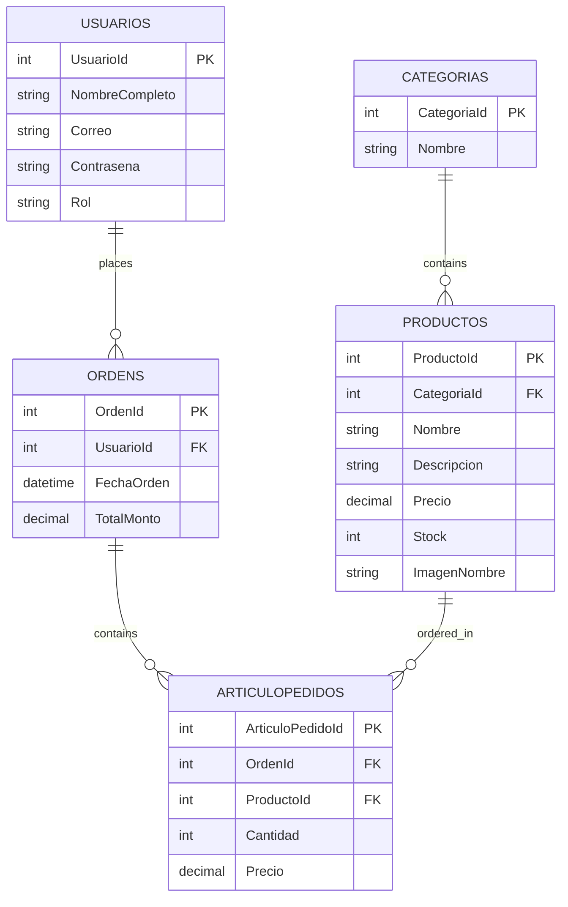

## Database Overview

MiTienda Web uses **SQL Server** with **Entity Framework Core 9.0.7** for data access. The database schema includes five main tables:

- **Categorias** - Product categories
- **Productos** - Product catalog
- **Usuarios** - User accounts
- **Ordens** - Customer orders
- **ArticuloPedidos** - Order line items

## Prerequisites

<Steps>
  <Step title="SQL Server Installation">
    Ensure SQL Server is installed and running. See [Environment Setup](/development/environment) for installation instructions.
  </Step>

  <Step title="Connection String Configuration">
    Configure your connection string in `appsettings.json`. See [Configuration Guide](/development/configuration#database-connection-string).
  </Step>

  <Step title="EF Core Tools">
    Verify Entity Framework Core tools are installed:
    ```bash
    dotnet ef --version
    ```
  </Step>
</Steps>

## Database Context

The `AppDbContext` class (located at `Context/AppDbContext.cs`) defines the database schema and relationships.

### DbSet Properties

```csharp Context/AppDbContext.cs
public DbSet<Categoria> Categorias { get; set; }
public DbSet<Producto> Productos { get; set; }
public DbSet<Usuario> Usuarios { get; set; }
public DbSet<Orden> Ordens { get; set; }
public DbSet<ArticuloPedido> ArticuloPedidos { get; set; }
```

### Entity Configuration

The `OnModelCreating` method configures:

<CardGroup cols={2}>
  <Card title="Primary Keys" icon="key">
    All entities use auto-incrementing integer IDs
  </Card>
  <Card title="Relationships" icon="link">
    Foreign keys with `Restrict` delete behavior
  </Card>
  <Card title="Data Types" icon="hashtag">
    Decimal precision for prices: `decimal(10,2)`
  </Card>
  <Card title="Seed Data" icon="seedling">
    Three default categories: Ropa, Electrónica, Hogar
  </Card>
</CardGroup>

### Key Relationships

```csharp Context/AppDbContext.cs
// Producto -> Categoria (Many-to-One)
e.HasOne(e => e.Categoria)
  .WithMany(p => p.Productos)
  .HasForeignKey(e => e.CategoriaId)
  .OnDelete(DeleteBehavior.Restrict);

// Orden -> Usuario (Many-to-One)
e.HasOne(e => e.Usuario)
  .WithMany(p => p.Ordenes)
  .HasForeignKey(e => e.UsuarioId)
  .OnDelete(DeleteBehavior.Restrict);

// ArticuloPedido -> Orden and Producto (Many-to-One each)
e.HasOne(e => e.Orden)
  .WithMany(p => p.ArticuloPedidos)
  .HasForeignKey(e => e.OrdenId)
  .OnDelete(DeleteBehavior.Restrict);

e.HasOne(e => e.Producto)
  .WithMany()
  .HasForeignKey(e => e.ProductoId)
  .OnDelete(DeleteBehavior.Restrict);
```

<Info>
  `DeleteBehavior.Restrict` prevents cascading deletes, ensuring referential integrity is maintained explicitly.
</Info>

## Initial Migration

The project includes an initial migration named `firstMigration` created on November 30, 2025.

### Migration Structure

The migration creates:

1. **Categorias Table**
   - `CategoriaId` (int, identity)
   - `Nombre` (nvarchar(max))

2. **Usuarios Table**
   - `UsuarioId` (int, identity)
   - `NombreCompleto` (nvarchar(max))
   - `Correo` (nvarchar(max))
   - `Contrasena` (nvarchar(max))
   - `Rol` (nvarchar(max))

3. **Productos Table**
   - `ProductoId` (int, identity)
   - `CategoriaId` (int, FK)
   - `Nombre` (nvarchar(max))
   - `Descripcion` (nvarchar(max))
   - `Precio` (decimal(10,2))
   - `Stock` (int)
   - `ImagenNombre` (nvarchar(max), nullable)

4. **Ordens Table**
   - `OrdenId` (int, identity)
   - `FechaOrden` (datetime2)
   - `UsuarioId` (int, FK)
   - `TotalMonto` (decimal(10,2))

5. **ArticuloPedidos Table**
   - `ArticuloPedidoId` (int, identity)
   - `OrdenId` (int, FK)
   - `ProductoId` (int, FK)
   - `Cantidad` (int)
   - `Precio` (decimal(10,2))

### Seed Data

The migration automatically seeds three categories:

```sql
INSERT INTO Categorias (CategoriaId, Nombre) VALUES
(1, 'Ropa'),
(2, 'Electrónica'),
(3, 'Hogar');
```

## Running Migrations

### First-Time Setup

<Steps>
  <Step title="Create the Database">
    If using SQL Server Express or LocalDB, the database will be created automatically. For other installations, create the database manually:

    ```sql
    CREATE DATABASE DBTiendaWeb;
    ```
  </Step>

  <Step title="Apply Migration">
    Run the existing migration to create the schema:

    ```bash
    dotnet ef database update
    ```

    This command:
    - Connects to the database using the connection string
    - Creates all tables
    - Sets up foreign key constraints
    - Inserts seed data
    - Creates indexes
  </Step>

  <Step title="Verify Setup">
    Connect to SQL Server and verify the tables were created:

    ```sql
    USE DBTiendaWeb;
    SELECT * FROM Categorias;
    ```

    You should see three categories: Ropa, Electrónica, and Hogar.
  </Step>
</Steps>

### Troubleshooting Migration Issues

<Warning>
  **Login Failed Error**
  
  If you see "Login failed for user", verify:
  - SQL Server is running
  - Connection string credentials are correct
  - User has permission to create databases
</Warning>

<Tip>
  **LocalDB Connection Issues**
  
  If using LocalDB, ensure the instance is started:
  ```bash
  sqllocaldb start mssqllocaldb
  sqllocaldb info mssqllocaldb
  ```
</Tip>

## Creating New Migrations

When you modify entity models or add new entities:

<Steps>
  <Step title="Add Migration">
    Create a new migration with a descriptive name:

    ```bash
    dotnet ef migrations add AddProductDescriptionLength
    ```

    This generates:
    - `Migrations/[timestamp]_AddProductDescriptionLength.cs`
    - `Migrations/[timestamp]_AddProductDescriptionLength.Designer.cs`
    - Updates `Migrations/AppDbContextModelSnapshot.cs`
  </Step>

  <Step title="Review Migration">
    Open the generated migration file and review the `Up()` and `Down()` methods:

    ```csharp
    protected override void Up(MigrationBuilder migrationBuilder)
    {
        // Changes to apply
    }

    protected override void Down(MigrationBuilder migrationBuilder)
    {
        // Changes to rollback
    }
    ```
  </Step>

  <Step title="Update Database">
    Apply the migration:

    ```bash
    dotnet ef database update
    ```
  </Step>
</Steps>

### Common Migration Commands

```bash
# List all migrations
dotnet ef migrations list

# Remove the last migration (if not applied)
dotnet ef migrations remove

# Update to a specific migration
dotnet ef database update MigrationName

# Rollback all migrations
dotnet ef database update 0

# Generate SQL script without applying
dotnet ef migrations script
```

<Info>
  The `dotnet ef migrations remove` command only works if the migration hasn't been applied to the database yet.
</Info>

## Database Schema Diagram



## Database Maintenance

### Resetting the Database

To completely reset the database (useful for development):

<Steps>
  <Step title="Drop Database">
    ```bash
    dotnet ef database drop
    ```
    
    Or manually:
    ```sql
    DROP DATABASE DBTiendaWeb;
    ```
  </Step>

  <Step title="Recreate Database">
    ```bash
    dotnet ef database update
    ```
  </Step>
</Steps>

<Warning>
  **Data Loss Warning**
  
  Dropping the database will permanently delete all data. Never run this in production!
</Warning>

### Backing Up Data

Before making schema changes, back up your database:

```sql
BACKUP DATABASE DBTiendaWeb
TO DISK = 'C:\Backups\DBTiendaWeb_backup.bak'
WITH FORMAT, COMPRESSION;
```

### Viewing Migration History

Check which migrations have been applied:

```sql
SELECT * FROM __EFMigrationsHistory ORDER BY MigrationId;
```

## Production Deployment

### Generate SQL Scripts

For production, generate SQL scripts instead of running migrations directly:

```bash
# Generate script from initial to latest migration
dotnet ef migrations script -o migration.sql

# Generate script for specific migration range
dotnet ef migrations script FromMigration ToMigration -o migration.sql

# Generate idempotent script (can run multiple times)
dotnet ef migrations script --idempotent -o migration.sql
```

<Tip>
  Use `--idempotent` scripts for production deployments. They check if migrations are already applied before executing.
</Tip>

### Migration Best Practices

<CardGroup cols={2}>
  <Card title="Test Migrations" icon="flask">
    Always test migrations on a copy of production data before deploying
  </Card>
  <Card title="Backup First" icon="floppy-disk">
    Create a database backup before applying migrations
  </Card>
  <Card title="Review Generated SQL" icon="file-code">
    Check the SQL script before execution to understand changes
  </Card>
  <Card title="Plan Rollback" icon="rotate-left">
    Ensure you can rollback by testing the Down() method
  </Card>
</CardGroup>

## Connection Pooling

Entity Framework Core automatically uses connection pooling. Configure pool size in the connection string if needed:

```
Data Source=server;Database=DBTiendaWeb;User ID=sa;Password=pass;Min Pool Size=5;Max Pool Size=100;
```

## Next Steps

<CardGroup cols={2}>
  <Card title="Repository Pattern" icon="layer-group" href="/architecture/repositories">
    Learn about the data access layer
  </Card>
  <Card title="Entity Models" icon="cube" href="/architecture/entities">
    Explore entity model definitions
  </Card>
</CardGroup>